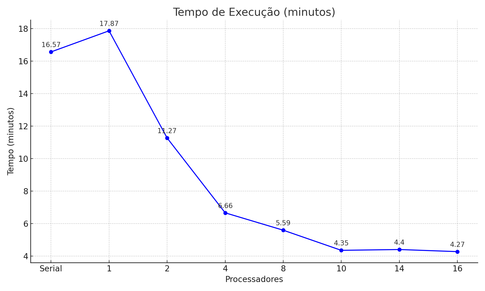

# Relatório de Pesquisa em Programação Paralela para Análise de Imagens Sismográficas

Config da maquina utilizada:
-12ª geração Intel® Core™ i7-12700 (12 Núcleos, 25MB, 20T, até 4.9GHz, 65W),
-16 GB DDR5 (1x16GB) 5600MT/s
-SSD de 512GB PCIe NVMe M.2 (Classe 25)

# Instruções
Antes de tudo, para que tudo funcione corretamente, recomendamos que você baixe o arquivo requirements.txt e execute o comando: "pip install -r requirements.txt" em seu terminal.

Para utilizar este sistema, siga os passos a seguir: 
# Passo 1
1- Alterar o caminho das pastas dos arquivos:

analisador.py: coloque o caminho da pasta onde estão as réplicas.

multiplicador.py: coloque o caminho da pasta onde serão multiplicadas as imagens, e no outro o caminho onde estão os PNGs das imagens dos sismógrafos.

serial.py: coloque o caminho da pasta onde estão as réplicas.
  

# Passo 2
2- Agora, escolha a quantidade de GB que deseja ter de réplicas das imagens dos sismógrafos. Em seguida, execute o multiplicador.py.

# Passo 3
3- Recomendamos que você execute o serial.py antes do multiplicador.py, para ter uma melhor noção do tempo e da eficiência, além de poder fazer comparações posteriormente.

# Passo 4
4- Logo após a conclusão do serial.py, execute o analisador.py com o seguinte comando em seu terminal: "python analisador.py -p número_threads". Recomendamos usar a quantidade máxima de -2, que corresponde ao máximo de núcleos da sua máquina, e em números pares. Por exemplo: se seu processador tem 20 núcleos, utilize até 18 threads.

# Passo 5
5- Após as execuções, você deverá notar que na pasta onde está localizado este projeto aparecerão dois arquivos: "todos_eventos_sismicos.csv" e "resumo_eventos.csv". Com esses arquivos, você pode usar o Orange Data Mining para visualizar os resultados com mais clareza, seguindo o procedimento: arraste esses dois arquivos para o aplicativo, conecte-os ao "Data Table" e, depois, abra o "Data Table".

# Introdução
Iniciamos esta pesquisa acadêmica de programação paralela com o objetivo de desenvolver um sistema em Python onde analisa uma grande quantidade de imagens, extraindo dados relevantes. Esses dados provêm do "Laboratório de Análise: Nana, Peru NNA_II, Vertical Component", que monitora e analisa abalos sísmicos na região do Peru.

# Descrição do Problema
Inicialmente, criamos um sistema totalmente serial (CPU bound) para processar a mesma quantidade de imagens, a fim de compreender os limites desse método e explorar alternativas de solução. Esse método se mostrou inviável devido ao tempo excessivo de processamento, evidenciando a necessidade de uma abordagem mais eficiente.

# Solução
Para superar as limitações do método serial, utilizamos imagens dos sismógrafos do Peru, coletadas do dia 28-04-2025 até 17-05-2025. Criamos um sistema que replicava essas imagens para obter um volume total de 50GB, contendo 74.315 imagens armazenadas em uma pasta.

A partir disso, o sistema principal utiliza multiprocessamento para analisar as imagens em pequenos lotes e gerar arquivos .CSV com os dados extraídos. Para visualizar e trabalhar esses dados, utilizamos o software Orange Data Mining.

A realização de testes com diferentes quantidades de processos (1, 2, 4, 6, 8, 10, 12, 14 e 16) visou analisar a melhora de desempenho obtida por meio do paralelismo, comparando o tempo de processamento em relação ao método serial.

# Resultados

| N° Processadores | Tempo (s) | Speedup (x) | % Mais Rápido   | Eficiência | 
|-------------------|------------|--------------|--------------|------------|
| 1                 | 1072       | 0.927        | -7.30%       | 100%       |
| 2                 | 676.08     | 1.471        | +47.10%      | 73.55%     |
| 4                 | 399.44     | 2.491        | +149.10%     | 62.28%     |
| 6                 | 335.27     | 2.967        | +196.70%     | 49.45%     |
| 8                 | 303.76     | 3.273        | +227.30%     | 40.91%     |
| 10                | 260.78     | 3.816        | +281.60%     | 38.16%     |
| 12                | 263.73     | 3.769        | +276.90%     | 31.41%     |
| 14                | 257.48     | 3.862        | +286.20%     | 27.59%     |
| 16                | 256.28     | 3.878        | +287.80%     | 24.24%     |

# Graficos

# Resultado serial:

# Resultados o multiprocessamento:
** 1 thread

** 2 threads

** 4 threads

** 6 threads

** 8 threads

** 10 threads

** 12 threads

** 14 threads

** 16 threads

# Conclusão
Com os testes realizados, foi comprovado que o paralelismo é uma das melhores soluções para este caso. Nos dias atuais, o uso do processamento paralelo é quase obrigatório para lidar com volumes massivos de dados, sendo fundamental para a eficiência do sistema. Assim, a pesquisa confirma a importância do uso de técnicas de programação paralela na automação da análise de grandes volumes de imagens sismográficas.
