# Relatório de Pesquisa em Programação Paralela para Análise de Imagens Sismográficas

Config da maquina utilizada:
-12ª geração Intel® Core™ i7-12700 (12 Núcleos, 25MB, 20T, até 4.9GHz, 65W),
-16 GB DDR5 (1x16GB) 5600MT/s
-SSD de 512GB PCIe NVMe M.2 (Classe 25)

# Introdução
Iniciamos esta pesquisa acadêmica de programação paralela com o objetivo de desenvolver um sistema em Python onde uma inteligência artificial analisa uma grande quantidade de imagens, extraindo dados relevantes. Esses dados provêm do "Laboratório de Análise: Nana, Peru NNA_II, Vertical Component", que monitora e analisa abalos sísmicos na região do Peru.

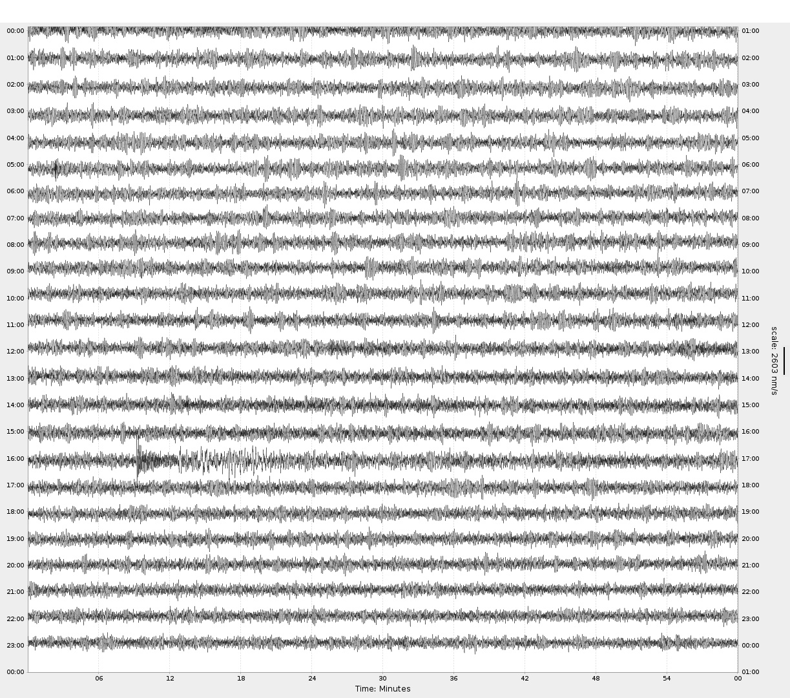

# Descrição do Problema
Inicialmente, criamos um sistema totalmente serial (CPU bound) para processar a mesma quantidade de imagens, a fim de compreender os limites desse método e explorar alternativas de solução. Esse método se mostrou inviável devido ao tempo excessivo de processamento, evidenciando a necessidade de uma abordagem mais eficiente.

# Solução
Para superar as limitações do método serial, utilizamos imagens dos sismógrafos do Peru, coletadas do dia 28-04-2025 até 17-05-2025. Criamos um sistema que replicava essas imagens para obter um volume total de aproximadamente 50GB, contendo cerca de 74.315 imagens armazenadas em uma pasta.

A partir disso, o sistema principal utiliza multiprocessamento para analisar as imagens em pequenos lotes e gerar arquivos CSV com os dados extraídos. Para visualizar e trabalhar esses dados, utilizamos o software Orange Data Mining.

A realização de testes com diferentes quantidades de processos (1, 2, 4, 6, 8, 10, 12, 14 e 16) visou analisar a melhora de desempenho obtida por meio do paralelismo, comparando o tempo de processamento em relação ao método serial.

# Resultados

| N° Processadores | Tempo (s) | Speedup (x) | % Mais Rápido |
|-------------------|------------|--------------|--------------|
| Serial            | 994.24     | 1.0000       | 0.00%        |
| 1                 | 1072       | 0.927        | -7.30%       |
| 2                 | 676.08     | 1.471        | +47.10%      |
| 4                 | 399.44     | 2.491        | +149.10%     |
| 6                 | 335.27     | 2.967        | +196.70%     |
| 8                 | 303.76     | 3.273        | +227.30%     |
| 10                | 260.78     | 3.816        | +281.60%     |
| 12                | 263.73     | 3.769        | +276.90%     |
| 14                | 257.48     | 3.862        | +286.20%     |
| 16                | 256.28     | 3.878        | +287.80%     |

# Grafico

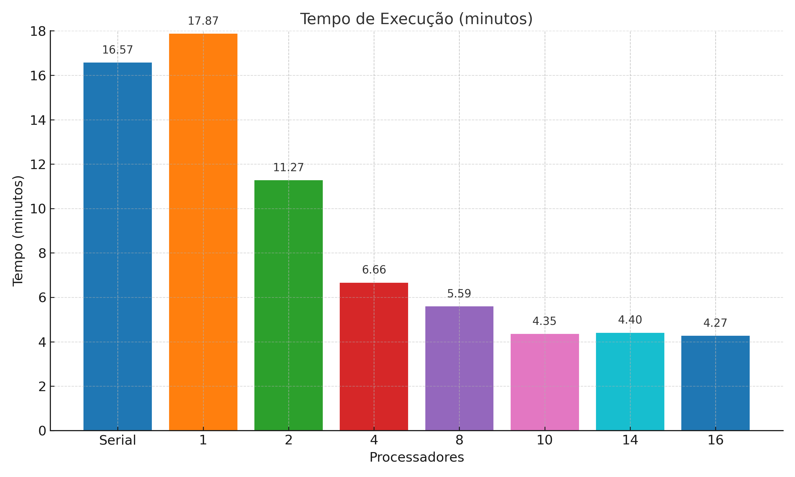

# Resultado serial:

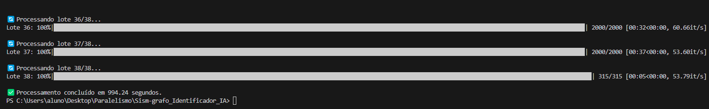

# Resuldados o multiprocessamento:
** 1 thread
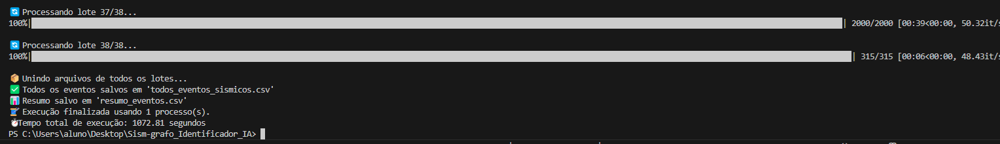

** 2 threads
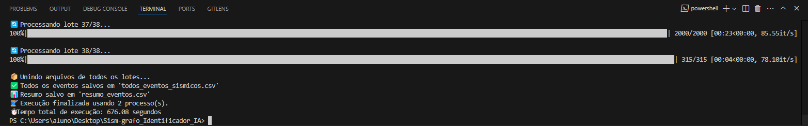

** 4 threads
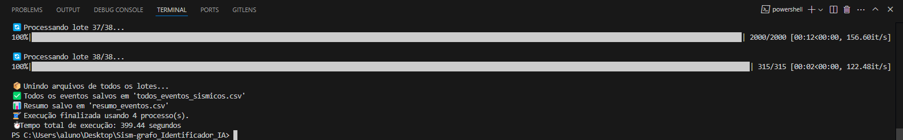

** 6 threads
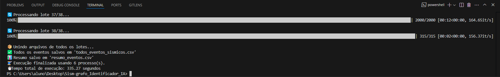

** 8 threads
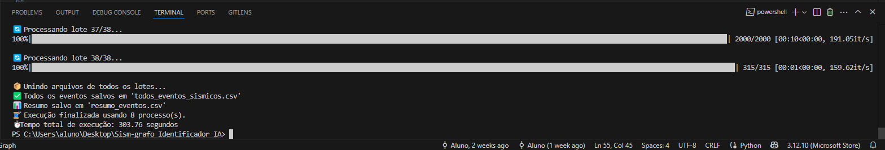

** 10 threads
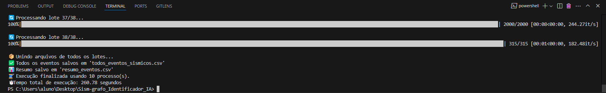

** 12 threads
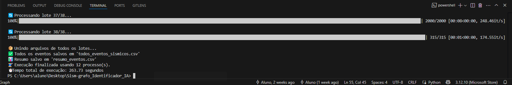

** 14 threads
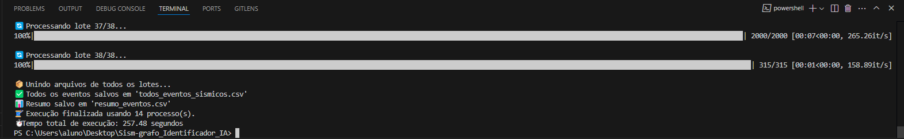

** 16 threads
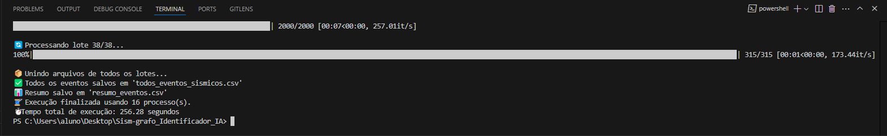

# Conclusão
Com os testes realizados, foi comprovado que o paralelismo é uma das melhores soluções para este caso. Nos dias atuais, o uso do processamento paralelo é quase obrigatório para lidar com volumes massivos de dados, sendo fundamental para a eficiência do sistema. Assim, a pesquisa confirma a importância do uso de técnicas de programação paralela na automação da análise de grandes volumes de imagens sismográficas.
