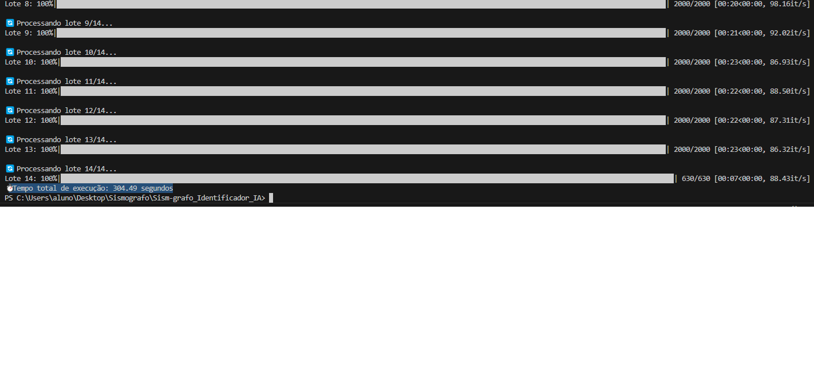
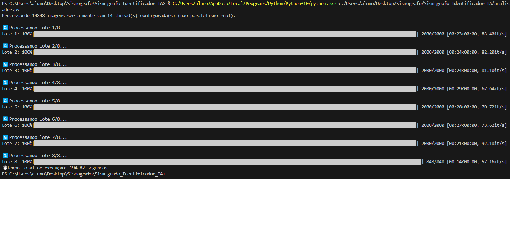
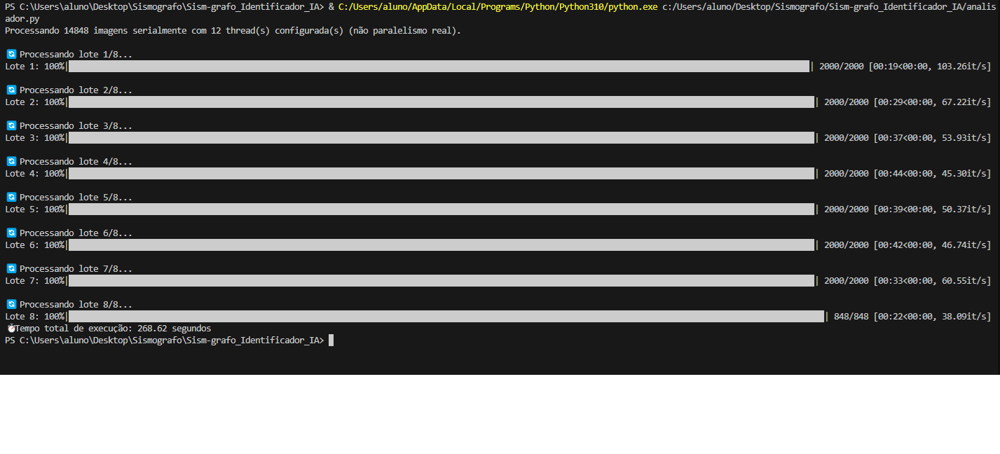
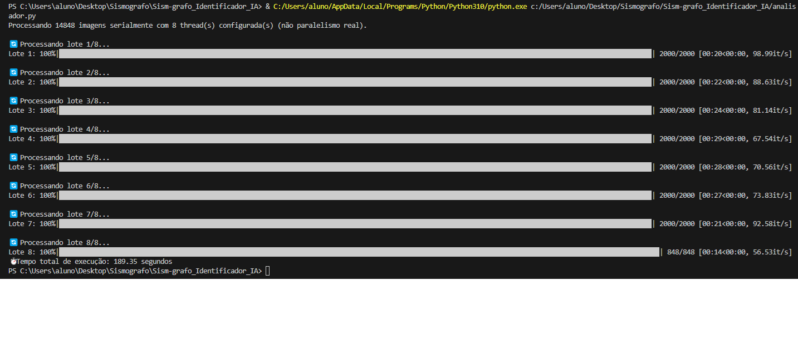
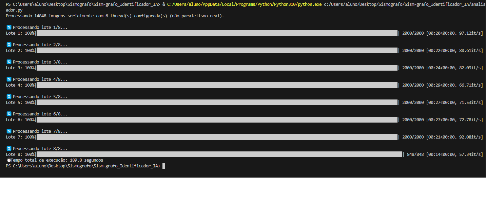
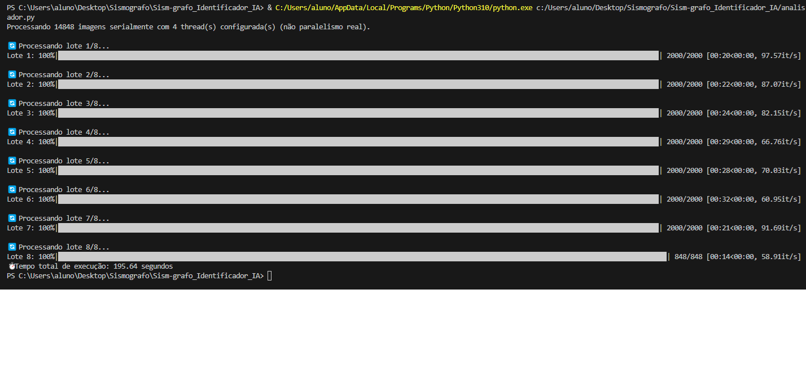
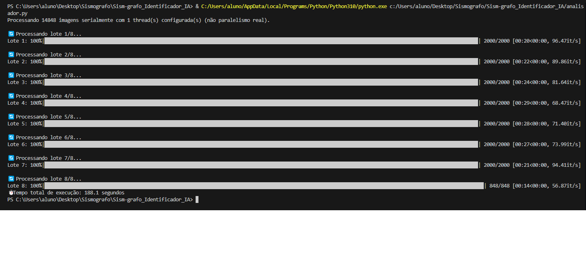

# Sism-grafo_Identificador_IA
Uma IA capaz de identificar um abalo sísmico em meio a uma quantidade massiva de imagens(arquivos)

Foram pegos 20 arquivos de sismografos desde 01-05-2025 até 20-05-2025

Laboratorio de analise: Nana, Peru NNA_II, Vertical Component

Site utilizado: https://www.iris.edu/app/station_monitor/

quantidade de arquivos = 74.315