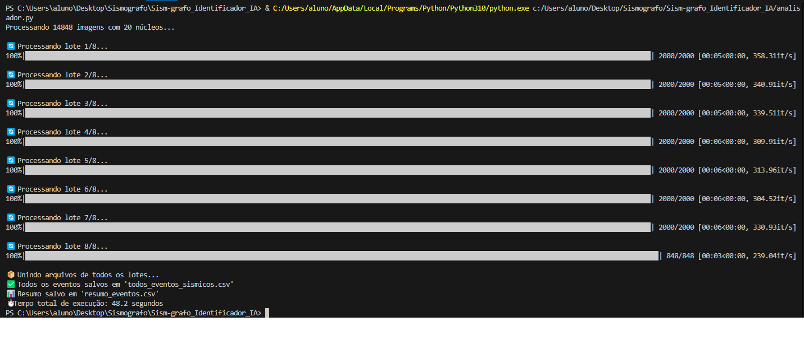

*****Relatório Técncio*****

**Descrição Geral**
O projeto tem como objetivo identificar eventos sísmicos em imagens de sismógrafos utilizando técnicas de paralelização em múltiplos núcleos, para aumentar a eficiência da análise. O sistema processa imagens e retorna, em formato tabular, os horários aproximados e intensidade dos eventos destaados.

**Tecnologias utilizadas**
-Phyton 3.x
-OpenCV
-NumPy
-Pandas
-TQDM
-Multiprocessing
-Glob / OS / Shutil

**Estrutura do Projeto**
(Quer que coloque a estrtutura (pastas) do projeto ?

**Pré-processamento: Multiplicação das Imagens ('multiplicador.py)**
- As 20 images originais são obtidas manualmente
- O script "multiplicador.py"
- - As imagens são nomeadas de forma incremental, preservando o formato ".png".
  
 *Objetivo:* Criar uma base de dados grande o suficiente para justificar o uso do paralelismo. Multiplicamos ate chegar em 50gb e comportar X arquivos.

**Detecção de Eventos:** 'Analisador.py'
- As imagens replicadas são processadas em paralelo por todos os núcleos disponíveis da máquina.
  *Técnicas aplicadas:*
  - Leitura em escala de cinza;
  - Desfoque;
  - Inversão de cores;
  - Extração de contornos ('cv2.findContours');
  *Saída:*
  Um arquivo '.csv' com as colunas:
  -'imagem', 'hora', 'minuto', 'segundo', 'intensidade'
---------------------------------------------------------------------------------------------------------------------------------------------------------------------------
# Sism-grafo_Identificador_IA
Uma IA capaz de identificar um abalo sísmico em meio a uma quantidade massiva de imagens(arquivos)

Foram pegos 20 arquivos de sismografos desde 28-04-2025 até 17-05-2025

Laboratorio de analise: Nana, Peru NNA_II, Vertical Component

Site utilizado: https://www.iris.edu/app/station_monitor/

---------------------------------------------------------------------------------------------------------------------------------------------------------------------------
**Instruções para o relatório**

ninguém é obrigado a ler o relatório todo para saber oq aconteceu (deixar isso claro na introdução)

Descrição do problema / justificativa

Descrição da solução

Resultados -> tabela // threads || tempo || speedup || eficiência

pq é importante seu trabalho, qual a contribuição dele

Conclusão

No dia da entrega, além do relatório, temos que fazer uma apresentação (contendo exatos 4 slides)
